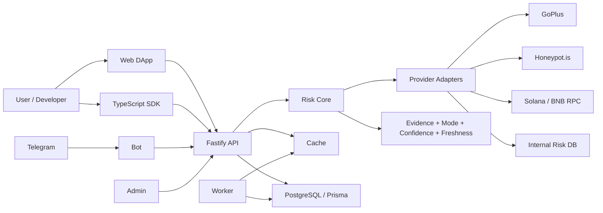

# ChainVigil

> Open-source, evidence-based Web3 risk analysis toolkit for tokens, wallets, bots, and onchain applications.

[](LICENSE)
[](#project-status)

ChainVigil aggregates external security providers, RPC evidence, and local rules into explainable risk reports. The current reference implementation focuses on Solana and BNB Chain and includes a Web DApp, API, Telegram Bot, SDK, Admin console, and worker contracts.


## Project status

**Maintenance mode / experimental reference implementation.**

- The repository is available for learning, integration experiments, and community contributions.
- No commercial SLA, hosted service, token, airdrop, yield, or investment return is promised.
- Mock, Sample, Readiness, Live, Mixed, Degraded, and Unassessed states must remain visibly distinct.
- Results are risk signals, not a formal audit, investment advice, or a guarantee that an asset is safe.
- Security fixes and focused improvements are welcome; there is no committed product roadmap.

## 60-second demo

After dependencies are installed:

```bash
pnpm install
pnpm dev
```

Open [http://localhost:3000](http://localhost:3000), then try one of the built-in sample inputs:

```text
Solana: So11111111111111111111111111111111111111112
BNB:     0x1111111111111111111111111111111111111110
```

Direct sample report:

```text
http://localhost:3000/token/bsc/0x1111111111111111111111111111111111111110
```

Default local services:

| Service | URL | Purpose |
|---|---|---|
| Web DApp | `http://localhost:3000` | CA checks, wallet reference views, reports |
| Admin | `http://localhost:3001` | Readiness, providers, review and audit views |
| API | `http://localhost:4000` | Risk, wallet, evidence and system contracts |
| Bot | `http://localhost:4001` | Telegram webhook reference implementation |
| Worker | background process | Job contracts and health heartbeat |

See the complete walkthrough in [docs/demo.md](docs/demo.md).

## Architecture



Core rule: a configured provider does not count as evidence until a real request succeeds. Provider failures degrade explicitly instead of being presented as live verification.

## Repository layout

```text
apps/
  web/       Next.js public site and Web DApp
  admin/     Next.js operations console
  api/       Fastify API and OpenAPI contract
  bot/       Telegram webhook service
  worker/    Background job reference implementation

packages/
  risk-core/       Risk evaluation rules
  data-adapters/   External provider adapters
  report/          Explainable report construction
  sdk/             TypeScript client
  types/           Shared public contracts
  db/              Prisma schema and persistence contracts
  cache/           Cache abstraction
  audit/           Redacted audit events
```

## Main capabilities

- Token risk reports for Solana and BNB Chain reference flows.
- Read-only wallet health and approval capability previews.
- Provider coverage, evidence provenance, confidence, and freshness contracts.
- GoPlus, Honeypot.is, BNB RPC, and Solana RPC adapters with explicit fallback.
- TypeScript SDK and OpenAPI skeleton.
- Telegram Bot, Admin, audit, rate-limit, cache, and worker reference implementations.
- Chinese and English UI architecture designed to support additional locales.

ChainVigil does **not** automatically trade, sign, revoke approvals, move assets, swap, bridge, or custody funds.

## Runtime modes

The default local mode is intentionally safe and explicit:

```env
CHAINVIGIL_RUNTIME_MODE=mock
APP_BASE_URL=http://localhost:3000
API_BASE_URL=http://localhost:4000
NEXT_PUBLIC_APP_BASE_URL=http://localhost:3000
NEXT_PUBLIC_API_BASE_URL=http://localhost:4000
```

For live provider experiments, copy the environment contract from `.env.example` and configure only the providers you intend to test. Production mode fails closed when required secrets or HTTPS URLs are missing or unsafe. See [SECURITY.md](SECURITY.md) and [docs/ops/runbook_v1.md](docs/ops/runbook_v1.md).

## Quality checks

```bash
pnpm typecheck
pnpm test
pnpm build
pnpm db:validate
pnpm launch:check
```

When all local services are running:

```bash
pnpm smoke:v0
```

## API example

```ts
import { ChainVigilClient } from "@chainvigil/sdk";

const client = new ChainVigilClient({
  baseUrl: "http://localhost:4000",
});

const report = await client.checkToken({
  chain: "solana",
  input: "So11111111111111111111111111111111111111112",
});

console.log(report.mode, report.confidence, report.riskLevel);
```

Structured API failures throw `ChainVigilApiError` with `status`, `code`, `field`, and a human-readable `message`.

## Contributing and security

- General contributions: [CONTRIBUTING.md](CONTRIBUTING.md)
- Community conduct: [CODE_OF_CONDUCT.md](CODE_OF_CONDUCT.md)
- Private vulnerability reports: [SECURITY.md](SECURITY.md)

Do not open a public Issue for an unpatched vulnerability, real credential, or user data exposure. Use GitHub **Security → Report a vulnerability**.

## License

Code and documentation are licensed under [Apache License 2.0](LICENSE). The license does not grant permission to use ChainVigil names, logos, or product marks beyond customary attribution.
