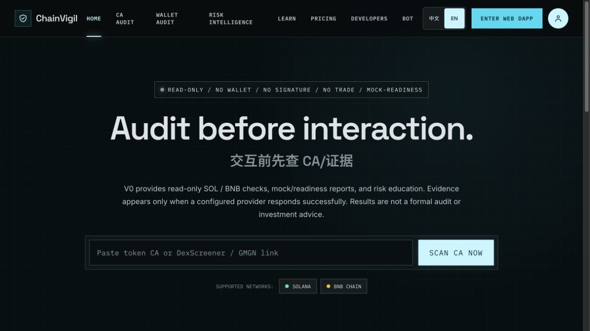
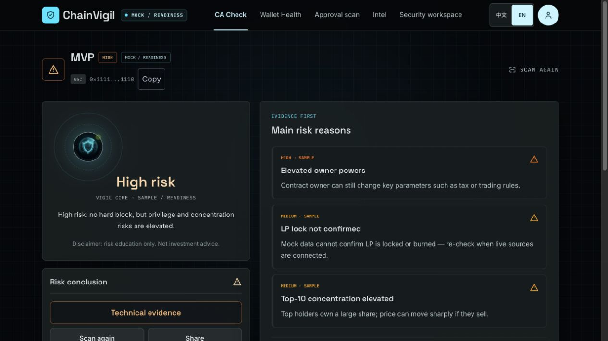

# ChainVigil 60-second demo

This walkthrough demonstrates the real local reference implementation. It intentionally uses built-in sample/readiness data unless live providers have been configured.

## 1. Start the stack

```bash
pnpm install
pnpm dev
```

Wait until Web, Admin, API, Bot, and Worker report ready or healthy.

## 2. Open the Web DApp

Visit:

```text
http://localhost:3000
```



The homepage clearly identifies the default flow as read-only, without wallet connection, signature, or trading.

## 3. Open a sample report

Paste this BNB sample address:

```text
0x1111111111111111111111111111111111111110
```

Or open the report directly:

```text
http://localhost:3000/token/bsc/0x1111111111111111111111111111111111111110
```



Check four things:

1. The result is visibly marked `MOCK / READINESS`.
2. Each risk reason is presented as evidence rather than an unexplained score.
3. Provider coverage distinguishes sample, unconfigured, degraded, and not-applicable sources.
4. Sharing keeps the detection mode and privacy boundary visible.

## 4. Inspect the API

```bash
curl http://localhost:4000/health
curl http://localhost:4000/api/v1/meta
curl http://localhost:4000/api/v1/risk/evidence-providers
curl http://localhost:4000/api/v1/system/readiness
```

The readiness endpoint returns missing configuration names and non-secret status information. It must never return credential values.

## 5. Stop the stack

Use `Ctrl+C` in the terminal running `pnpm dev`.

The demo is complete. Live risk conclusions require configured providers and independent validation of their returned evidence.
