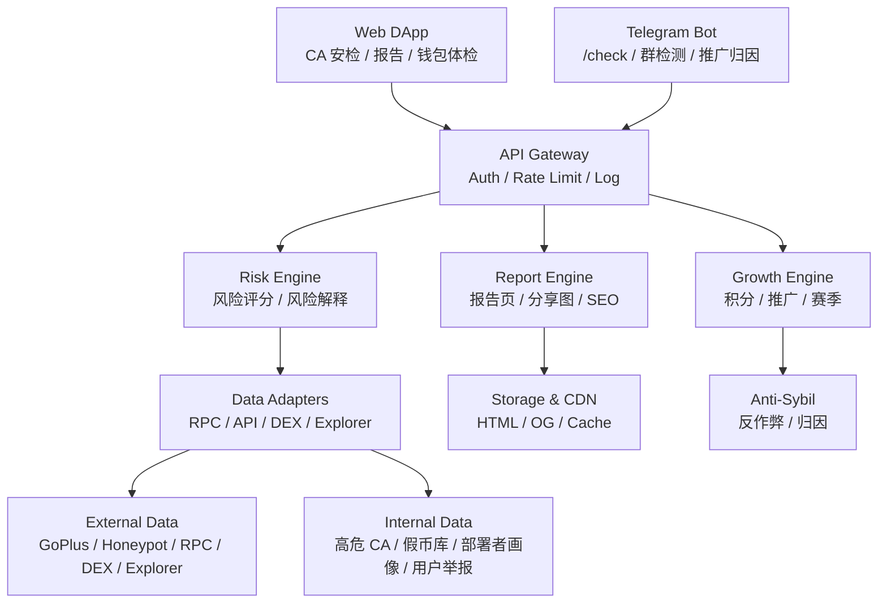

# Token 哨兵 / 资产理发师｜版本规划与技术设计 v0.1

> 文档定位：本文件用于指导后续产品排期、技术架构设计、研发拆分与 MVP 落地。  
> 当前阶段重点：先做 Web DApp + CA 安检 + 报告传播 + Telegram Bot + 积分推广闭环。  
> 暂不纳入核心范围：全自动交易拦截、浏览器插件、粉尘跨链归集、平台币承诺。

---

## 0. 当前共识与边界

### 0.1 产品总定位

Token 哨兵 / 资产理发师是一个 Web3 超级安全工具，围绕用户链上交易生命周期提供安全能力：

```text
买前：查 CA，判断这个币能不能买、能不能卖、是否貔貅/假币/高危合约
交易中：提供风险解释和交易前辅助判断，但不做全自动拦截
买后：钱包体检、授权清理、粉尘扫描、资产整理
增长：分享报告、Telegram Bot、SEO/GEO、积分推广体系
```

核心主张：

> 买币前，先查 CA。  
> 钱包用久了，定期做安全体检和资产清理。

---

### 0.2 当前已定决策

| 模块 | 决策 |
|---|---|
| Web DApp | 核心主产品形态 |
| CA 安检 | 第一入口，P0 |
| Token 风险报告页 | P0，承担分享、SEO/GEO、信任建立 |
| Telegram Bot | P0/P0.5，吃群聊 CA 流量 |
| 分享卡片 | P0，作为社交传播燃料 |
| SEO/GEO | 长期流量资产，P0/P1 起步 |
| 钱包只读体检 | P1，作为查币后的转化入口 |
| 授权扫描/撤销 | P1，第一高价值执行功能 |
| 积分体系 | P0/P1 起步，承担留存、贡献、推广奖励三种作用 |
| 粉尘扫描 | P3 前后引入 |
| 粉尘归集 | 后置，高难执行模块 |
| 浏览器插件 | 暂不做，P3 可选，仅作为风险提示工具 |
| 全自动交易拦截 | 不做 |
| 平台币 | 不承诺，只沉淀积分和贡献记录 |

---

### 0.3 产品落地原则

```text
先查币，不连钱包。
先报告，不动资产。
先传播，再转化。
先 EVM，再多链。
先扫描，再执行。
先积分记录，再谈平台币。
先低风险工具，再高风险执行。
```

---

## 1. 版本路线图总览

| 版本 | 核心目标 | 核心功能 | 明确不做 |
|---|---|---|---|
| V0 | 查 CA，建立传播入口 | Web DApp、CA 安检、报告页、分享卡片、基础积分 | 不连钱包、不动资产、不做插件 |
| V0.5 | 吃群聊 CA 流量 | Telegram Bot、群内 `/check`、推广归因 | 不自动刷屏、不做交易 |
| V1 | 钱包安全转化 | 钱包体检、授权扫描、单个/批量撤销、钱包报告 | 不做粉尘归集、不做插件 |
| V2 | 安全网络增长 | 积分推广、榜单、举报、部署者画像、API 内测 | 不承诺发币 |
| V3 | 资产理发师增强 | 粉尘扫描、垃圾资产识别、月度体检、持仓风险监控 | 不急着跨链归集 |
| V4 | 高级执行生态 | 粉尘归集、API 商业化、链上贡献凭证、生态治理准备 | 视数据推进 |

---

## 2. V0：CA 安检 MVP

### 2.1 V0 目标

让用户形成第一心智：

> 看到一个 CA，不要马上冲，先来 Token 哨兵查一下。

V0 的核心不是大而全，而是让用户在极短路径内完成一次可信检测，并愿意把报告分享到群里。

---

### 2.2 V0 用户路径

```text
用户看到一个 CA
        ↓
进入 Web DApp
        ↓
粘贴 CA / DexScreener 链接 / GMGN 链接
        ↓
系统识别链和 token
        ↓
输出风险结论
        ↓
生成报告页
        ↓
用户分享到 Telegram / X
        ↓
更多用户点击报告继续检测
```

---

### 2.3 V0 核心功能

#### 2.3.1 首页

首页第一屏只做一件事：查 CA。

建议文案：

```text
买币前，先查 CA

AI 检测貔貅盘、高税、黑名单、LP 风险、Owner 后门和假币风险。

[ 粘贴 Token 合约地址 / DexScreener 链接 / GMGN 链接 ]
[ 立即安检 ]

免费检测｜无需连接钱包｜支持 ETH / BSC / Base / Arbitrum / Polygon / Optimism
```

首页原则：

```text
不要求连接钱包
不要求签名
不要求登录
不要求安装插件
直接输入即可检测
```

---

#### 2.3.2 CA 输入与解析

支持输入：

```text
Token 合约地址
Pair 地址
DexScreener 链接
GMGN 链接
DEXTools 链接
Etherscan/BscScan/BaseScan 链接
```

系统解析：

```text
识别所属链
识别 token address
识别 pair address
识别是否为 token 合约
识别是否为 pair 合约
识别 DEX / router / pool 类型
```

---

#### 2.3.3 CA 安检基础项

V0 检测项：

```text
是否可以买
是否可以卖
是否疑似 honeypot / 貔貅
买入税
卖出税
转账税
是否可改税
是否有黑名单
是否有白名单
是否可暂停交易
是否可增发
是否可销毁用户余额
owner 是否放弃
合约是否开源
是否代理合约
LP 是否存在
LP 大小
LP 是否疑似未锁
主池配对资产
holder 数量
前 10 持仓集中度
部署者是否高危
是否假冒知名币
是否已被风险库标记
```

---

#### 2.3.4 风险结论

前台不要只展示技术字段，要直接给用户可理解结论。

风险等级：

```text
禁买
高危
谨慎
可小额尝试
相对低风险
无法判断
```

建议前台展示示例：

```text
AI 结论：禁买｜疑似貔貅盘

主要原因：
1. 卖出仿真失败，当前路径无法正常卖出
2. 合约 owner 可修改卖出税
3. 存在黑名单权限，项目方可限制指定地址交易
4. LP 未锁，存在撤池风险

建议：不要买入。如果已持有，优先尝试小额卖出，不要继续加仓。
```

---

#### 2.3.5 Token 风险报告页

每个 token 生成固定报告页：

```text
/token/[chain]/[address]
```

页面结构：

```text
风险结论
风险原因
检测时间
重新检测按钮
分享按钮
买卖仿真结果
合约权限
流动性信息
持仓分布
部署者画像
用户举报
相似假币
免责声明
```

每个报告页必须支持：

```text
唯一 URL
重新检测
历史快照
一键复制链接
一键分享到 X / Telegram
生成 OG 分享图
```

---

#### 2.3.6 分享卡片

每次检测都生成分享图，用于社交传播。

示例：

```text
禁买：疑似貔貅盘

卖出失败｜LP 未锁｜Owner 可改税｜黑名单权限存在

Chain：Base
Token：XXX
Checked by Token Sentinel
```

分享卡片目标：

```text
让用户在群里快速证明“我查过，这币有问题”。
让每一次检测成为一次传播。
```

---

#### 2.3.7 基础积分记录

V0 只做轻积分，不做复杂任务墙。

记录事件：

```text
首次 CA 安检
每日首次 CA 安检
首次检测新 CA
分享报告
分享带来有效访问
分享带来有效 CA 检测
举报高危 CA
```

V0 积分以 `pending / confirmed / rejected` 方式记录，避免后期无法反作弊。

---

### 2.4 V0 不做清单

```text
不做浏览器插件
不做自动交易拦截
不做钱包签名拦截
不做钱包连接强制登录
不做粉尘归集
不做跨链资产整理
不做 Solana / BTC / Cosmos
不做平台币领取
不做积分兑换 token
不做自动 swap
不做自动撤销授权
不托管资产
```

---

### 2.5 V0 验收标准

```text
用户能在首页 3 步内完成 CA 检测
检测结果 3 秒内返回基础结论，深度数据可异步补全
报告页可分享
每个检测结果有唯一 URL
高危原因可解释
检测结果有时间戳
支持重新检测
支持基础积分记录
后台可人工修正误报/漏报
```

---

## 3. V0.5：Telegram Bot + 分享传播版

### 3.1 V0.5 目标

吃群聊里的 CA 流量。

Web3 新币传播现场往往不是 Google，而是：

```text
Telegram 群
微信群
Discord
X 推文
Alpha 群
KOL 社群
```

所以 Bot 的目标是让 Token 哨兵出现在 CA 旁边。

---

### 3.2 Bot 用户路径

```text
群里有人发 CA
        ↓
用户输入 /check 0x...
        ↓
Bot 返回：高危 / 谨慎 / 低风险
        ↓
点击进入完整报告页
        ↓
分享者获得推广积分
        ↓
群主获得群贡献数据
```

---

### 3.3 Bot 核心功能

基础命令：

```text
/check 0x...
/report 0x...
/top
/help
/settings
```

群主设置：

```text
自动检测 CA：开 / 关
高危提醒：开 / 关
重复检测合并：开 / 关
每日检测上限
语言：中文 / 英文
风险提醒阈值
```

Bot 回复格式：

```text
Token 哨兵检测结果：高危

风险原因：
1. 卖出税 35%
2. LP 未锁
3. Owner 可修改税率
4. 前 10 持仓 78%

完整报告：
/token/base/0x...
```

---

### 3.4 Bot 防刷机制

```text
同群同 CA 缓存
同用户频率限制
同群每日免费额度
同一个 CA 重复检测不重复给积分
假群不结算推广积分
群内刷屏保护
高危提醒合并
```

---

### 3.5 V0.5 不做

```text
不默认监听所有消息
不做强制自动刷屏
不直接给投资建议
不允许无限免费刷接口
不做自动交易
不做钱包连接
```

---

## 4. V1：钱包体检 + 授权扫描/撤销

### 4.1 V1 目标

把“查币用户”转化为“钱包安全用户”。

核心链路：

```text
查 CA
  ↓
信任报告
  ↓
输入钱包地址做只读体检
  ↓
发现历史风险
  ↓
连接钱包执行授权撤销
  ↓
生成钱包清理报告
  ↓
获得积分 / 成为会员
```

---

### 4.2 V1 核心功能

```text
钱包地址只读体检
授权扫描
授权风险分级
单个撤销授权
批量撤销基础版
钱包安全报告
会员权益雏形
积分推广中心
```

---

### 4.3 钱包体检

支持输入钱包地址，不强制连接钱包。

扫描内容：

```text
持有 token 风险
疑似假币
高危 token
垃圾 NFT
授权数量
无限授权数量
高危 spender
长期未使用授权
钱包健康分
```

输出示例：

```text
钱包健康分：72
高危授权：3
中危授权：11
疑似垃圾 token：28
疑似假币：2
建议立即处理：3 项
```

---

### 4.4 授权扫描范围

支持：

```text
ERC20 approve
ERC721 setApprovalForAll
ERC1155 setApprovalForAll
无限授权识别
spender 地址识别
spender 风险标签
授权时间
授权额度
用户最近是否使用该协议
```

---

### 4.5 授权风险分级

#### 高危授权

```text
未知 spender
已标记恶意 spender
钓鱼 / 跑路项目 spender
无限授权 + 长期未使用
高价值资产授权给未知合约
授权给可疑代理合约
```

#### 中危授权

```text
长期未使用
过期 DApp
低活跃项目
用户已无相关资产但授权仍存在
项目合约不再维护
```

#### 低危授权

```text
知名协议
用户近期仍在使用
授权额度较低
合约稳定且未被标记风险
```

---

### 4.6 授权撤销流程

```text
用户连接钱包
        ↓
选择授权项
        ↓
系统显示撤销说明
        ↓
显示 gas 预估
        ↓
用户确认
        ↓
钱包签名交易
        ↓
链上执行
        ↓
刷新状态
        ↓
生成清理报告
```

支持执行：

```text
ERC20：approve(spender, 0)
ERC721：setApprovalForAll(operator, false)
ERC1155：setApprovalForAll(operator, false)
```

---

### 4.7 V1 安全原则

```text
用户自己签名
每笔交易清楚解释
显示 gas 预估
显示撤销对象
撤销前二次确认
不托管资产
不代签名
不批量隐藏交易意图
不请求 token approve 给我们自己的合约
```

---

### 4.8 V1 不做

```text
不做粉尘归集
不做跨链 bridge
不做 NFT burn
不做自动清理
不做浏览器插件
不做交易拦截
```

---

## 5. V2：安全网络 + 积分推广增长版

### 5.1 V2 目标

让用户、群主、KOL、安全猎人共同参与安全网络建设和产品传播。

V2 的重点不是链上执行，而是：

```text
数据网络
用户贡献
推广增长
榜单传播
安全数据库
API 生态雏形
```

---

### 5.2 V2 核心功能

```text
安全贡献系统
推广奖励系统
赛季积分
群主面板
KOL 推广链接
高危 CA 榜单
假币数据库
部署者风险画像
用户举报 / 申诉系统
API 内测版
```

---

### 5.3 积分三层结构

前台可以统一叫“哨兵积分”，后台必须区分来源。

```text
XP 成长积分：活跃、等级、产品权益
安全贡献分：高危 CA、假币、授权风险、风险规则贡献
推广奖励分：邀请、分享、Bot 入群、KOL 内容、有效转化
```

---

### 5.4 推广积分原则

核心原则：

> 奖励有效转化，不奖励空动作。

有效链路：

```text
分享报告
  ↓
带来有效访问
  ↓
带来 CA 检测
  ↓
带来钱包体检
  ↓
带来授权清理
  ↓
结算推广积分
```

不奖励：

```text
单纯邀请一个钱包
单纯转发一次
单纯连接钱包
单纯刷访问
单纯加入群
```

---

### 5.5 安全数据资产

V2 开始沉淀自有数据：

```text
高危 CA 数据库
假币数据库
貔貅币历史库
高危部署者地址库
恶意 spender 数据库
群内热传 CA 数据
用户举报数据
风险快照数据
误报 / 申诉数据
风险规则版本库
```

这些数据是长期壁垒。

---

### 5.6 V2 不做

```text
不承诺发币
不做积分兑换 token
不把积分和未来平台币线性绑定
不无限发积分
不做没有反作弊的邀请返利
```

---

## 6. V3：资产理发师增强版

### 6.1 V3 目标

从“查币安全工具”升级到“钱包健康管理工具”。

重点不是立即帮用户归集资产，而是先准确判断：

```text
哪些资产有价值
哪些资产是垃圾
哪些资产可以回收
哪些资产不值得处理
哪些资产不能碰
```

---

### 6.2 V3 核心功能

```text
粉尘资产扫描
垃圾 token 识别
垃圾 NFT 识别
可回收资产估算
不建议处理资产标记
钱包整洁度评分
月度钱包体检
持仓 token 风险监控
```

---

### 6.3 粉尘资产分类

#### 可回收资产

```text
有价格
有流动性
可正常卖出
税率合理
归集收益 > gas + 滑点 + 路由费
```

#### 建议隐藏资产

```text
无价格
无流动性
spam token
垃圾 NFT
无效空投
```

#### 禁止处理资产

```text
疑似 honeypot
转账税异常
交互存在风险
疑似钓鱼空投
SBT / 身份凭证
历史凭证类 NFT
处理成本高于价值
```

---

### 6.4 V3 暂不做

```text
跨链粉尘归集
自动 swap
自动 bridge
自动 burn NFT
自动处理所有小资产
```

---

## 7. V4：高级执行与平台生态版

### 7.1 V4 目标

在风险引擎、用户信任、数据网络和付费能力都稳定后，再推进高级执行。

---

### 7.2 V4 可考虑功能

```text
跨链粉尘归集
gas 优化
批量交易
智能账户
paymaster / gas sponsor
API 商业化
企业版风控
平台币治理准备
链上贡献凭证
安全节点 / 贡献者体系
```

---

## 8. 总体技术架构

### 8.1 架构图



---

### 8.2 技术分层

```text
Frontend Layer：Web DApp / SEO 页面 / 报告页 / 分享图
API Layer：统一接口、鉴权、限流、日志
Risk Layer：CA 风险检测、评分、解释、证据整合
Data Layer：第三方 API、RPC、DEX 数据、自建风险库
Report Layer：Token 报告、钱包报告、OG 图、榜单
Growth Layer：积分、推广归因、赛季、排行榜
Bot Layer：Telegram Bot、群组配置、群内检测
Admin Layer：人工审核、误报修正、积分审核、风险标记
```

---

## 9. 技术栈建议

### 9.1 前端

```text
Next.js
TypeScript
Tailwind CSS
shadcn/ui 或自研组件库
SSR / ISR 支持 SEO
动态 OG 图
i18n：英文 + 中文
移动端优先
```

原则：

```text
不要做纯客户端 DApp
工具页和报告页必须 SEO 友好
首页首屏速度要快
报告分享图要清晰刺激
```

---

### 9.2 钱包连接

V0 不强制钱包连接。  
V1 开始接入。

建议支持：

```text
WalletConnect / Reown
Injected wallets
MetaMask
OKX Wallet
Trust Wallet
Coinbase Wallet
```

优先 EVM，Solana 后置。

---

### 9.3 后端

建议技术：

```text
Node.js / TypeScript
NestJS 或 Fastify
viem / ethers 用于 EVM 交互
BullMQ / Temporal 做异步任务
PostgreSQL 做主数据库
Redis 做缓存和限流
S3 / Cloudflare R2 做分享图和静态资产
ClickHouse / BigQuery 做行为分析，后置
```

架构建议：

```text
V0 不要过度微服务
先做模块化单体
模块包括 api / risk / report / growth / bot / admin / worker
等流量起来后再拆服务
```

---

### 9.4 链上与安全数据

早期第三方为主：

```text
GoPlus
Honeypot.is
RPC Provider
DEX 数据源
区块浏览器 API
自建风险库
```

后期逐步自建：

```text
token risk snapshots
approval event indexer
deployer profile
fake token registry
spender risk registry
community report database
```

---

## 10. CA 安检引擎设计

### 10.1 输入

```json
{
  "chain": "base",
  "address": "0x...",
  "source": "web | telegram | api",
  "referrer": "optional",
  "forceRefresh": false
}
```

也支持输入原始文本：

```text
CA
Pair 地址
DexScreener 链接
GMGN 链接
DEXTools 链接
```

---

### 10.2 检测流程

```text
1. 输入解析
   - 识别链
   - 识别 token address
   - 识别 pair address
   - 判断是否为 token / pair / URL

2. 基础信息读取
   - name
   - symbol
   - decimals
   - totalSupply
   - owner
   - verified source
   - proxy status

3. 第三方安全数据
   - token security
   - honeypot result
   - malicious address
   - known scam labels

4. 交易仿真
   - buy simulation
   - sell simulation
   - buy tax
   - sell tax
   - transfer tax
   - cannot sell
   - max sell / max buy

5. 合约权限扫描
   - blacklist
   - whitelist
   - mint
   - burn
   - pause
   - modifiable tax
   - trading switch
   - maxTx / maxWallet
   - owner privileges

6. 流动性检测
   - pool exists
   - pool value
   - main pair
   - LP lock / burn
   - liquidity concentration
   - recent remove liquidity

7. 持仓结构
   - holders count
   - top 10 holders
   - deployer balance
   - contract balance
   - suspicious cluster

8. 部署者画像
   - deployer history
   - previous token count
   - previous rug / scam relation
   - funding source
   - malicious address relation

9. 结果合成
   - risk score
   - risk level
   - human-readable reasons
   - recommendation
```

---

### 10.3 输出格式

```json
{
  "riskLevel": "BLOCK | HIGH | MEDIUM | LOW | UNKNOWN",
  "label": "禁买",
  "score": 12,
  "summary": "疑似貔貅盘，卖出仿真失败，且合约 owner 可修改卖出税。",
  "reasons": [
    {
      "severity": "critical",
      "title": "卖出仿真失败",
      "explanation": "当前检测路径下无法正常卖出，存在买入后无法退出的风险。"
    }
  ],
  "evidence": {
    "buyTax": "3%",
    "sellTax": "100%",
    "lpValueUsd": 8200,
    "ownerCanModifyTax": true
  },
  "checkedAt": "2026-07-08T00:00:00Z"
}
```

---

## 11. 风险评分模型

### 11.1 评分原则

不要只做总分，必须有“一票否决”。

---

### 11.2 一票否决项

出现以下情况，直接进入“禁买”或“高危”：

```text
卖出失败
honeypot 命中
100% 或极高卖出税
已知恶意合约
假冒主流 token
无有效流动性但可买
黑名单已命中
owner 可任意转移用户资产
已被官方 / 社区标记诈骗
```

---

### 11.3 加权评分项

```text
交易风险：35%
合约权限：25%
流动性风险：20%
持仓集中度：10%
部署者 / 信誉：10%
```

---

### 11.4 风险等级映射

```text
0–20：禁买
21–40：高危
41–65：谨慎
66–85：可小额尝试
86–100：相对低风险
无法获取关键数据：无法判断
```

前台文案注意：

```text
不要写：安全，可以买
建议写：未发现明显交易安全问题
```

---

## 12. 报告系统与 SEO/GEO

### 12.1 报告页路由

```text
/token/[chain]/[address]
/wallet/[address]/health
/risk-database/honeypot
/risk-database/fake-usdt
/leaderboard/high-risk-tokens
```

---

### 12.2 Token 报告页内容

```text
风险结论
风险原因
检测时间
重新检测按钮
分享按钮
买卖仿真结果
合约权限
流动性信息
持仓分布
部署者画像
用户举报
相似假币
免责声明
```

---

### 12.3 SEO Index 规则

不是所有 token 页面都应该被索引。

#### 允许 index

```text
有交易量
有流动性
有用户访问
有高危标记
有独特报告内容
热门查询 token
被多人举报 / 讨论的 token
```

#### noindex

```text
无流动性
无数据
重复垃圾 CA
批量低质量页面
错链页面
无用户访问的空报告页
```

---

### 12.4 GEO 内容资产

后续沉淀：

```text
什么是貔貅盘
如何判断 token 能不能卖
什么是卖出税
什么是 LP 未锁
什么是黑名单权限
如何识别假 USDT
如何撤销钱包授权
什么是无限授权风险
```

每个词条都应该结构化：

```text
定义
风险解释
检测方法
真实案例
输入 CA 自动检测入口
```

---

## 13. Telegram Bot 技术设计

### 13.1 API 关系

Bot 不单独做风险逻辑，全部复用 Web DApp 后端：

```text
Telegram Bot
    ↓
/api/v1/token/check
    ↓
Risk Engine
    ↓
Report URL
```

---

### 13.2 Bot 数据归因

每次 Bot 查询记录：

```text
telegram_user_id
telegram_group_id
message_id
query_text
token_address
chain
report_id
referral_code
created_at
```

用于：

```text
群主积分
推广归因
群活跃统计
热门 CA 数据
防刷识别
```

---

### 13.3 群主面板

V0.5/V2 增强：

```text
本群检测次数
本群高危 CA 数
本群有效用户数
Bot 自动检测开关
高危提醒阈值
本群安全贡献积分
```

---

## 14. 钱包体检技术设计

### 14.1 输入

```json
{
  "address": "0x...",
  "chains": ["ethereum", "bsc", "base"]
}
```

---

### 14.2 扫描内容

```text
持有 token 风险
疑似假币
高危 token
垃圾 NFT
授权数量
无限授权数量
高危 spender
长期未使用授权
钱包健康分
```

---

### 14.3 钱包健康分因素

```text
高危授权数量
无限授权数量
高危 token 持仓
垃圾 NFT 数量
最近高危交互
授权资产价值暴露
长期未清理授权
是否持有已标记恶意 token
```

---

## 15. 授权撤销技术设计

### 15.1 支持授权类型

```text
ERC20 approve(spender, 0)
ERC721 setApprovalForAll(operator, false)
ERC1155 setApprovalForAll(operator, false)
```

---

### 15.2 授权数据来源

V1 初期：

```text
第三方 approval API
区块浏览器 API
RPC 当前 allowance 校验
```

后续自建：

```text
Approval 事件索引
ApprovalForAll 事件索引
spender 风险库
历史授权快照
```

---

### 15.3 撤销执行原则

```text
不请求转账权限
不请求用户授权 token 给我们
不托管资产
不隐藏 calldata
不自动批量执行
每笔交易可解释
失败后不重复扣积分
```

---

## 16. 积分与推广系统设计

### 16.1 积分定位

积分承担三种作用：

```text
留存：让用户持续使用产品
贡献：记录真实安全价值
推广：奖励带来真实增长的人
```

不对外承诺：

```text
积分兑换平台币
固定空投比例
做任务必得 token
积分越多未来币越多
```

---

### 16.2 积分事件模型

所有积分都以事件记录，不直接改总分。

```text
point_events
- event_id
- user_id
- wallet_address
- event_type
- source
- base_points
- quality_multiplier
- sybil_multiplier
- final_points
- status: pending / confirmed / rejected
- season_id
- evidence
- created_at
- confirmed_at
```

---

### 16.3 积分来源

```text
CA 检测
新 CA 首检
高危 CA 举报
分享报告
邀请有效用户
钱包体检
撤销高危授权
Bot 入群
群内有效检测
KOL 推广
API 集成
安全规则贡献
```

---

### 16.4 推广归因

```text
referral_code
utm_source
utm_campaign
telegram_group_id
kol_id
share_report_id
first_touch
last_touch
activation_event
```

---

### 16.5 结算规则

```text
低价值行为：即时积分
高价值行为：待确认积分
邀请 / 群 / Bot / KOL / API：延迟确认
疑似女巫：积分打折或冻结
恶意行为：清零或封禁
```

---

### 16.6 反作弊规则

重点防：

```text
自己邀请自己
批量钱包注册
批量查垃圾 CA
脚本刷访问
假群安装 Bot
KOL 假数据
同一设备多账号
同一资金源多钱包
短时间重复行为
低质量内容灌水
```

处理策略：

```text
待确认积分
每日上限
质量系数
反女巫系数
设备 / IP / 钱包聚类
群组真实性验证
KOL 渠道异常检测
人工审核高价值贡献
```

---

## 17. 数据库设计草案

### 17.1 users

```sql
id
email nullable
telegram_id nullable
x_id nullable
primary_wallet nullable
created_at
risk_level
sybil_score
status
```

---

### 17.2 wallets

```sql
id
user_id
address
chain
first_seen_at
wallet_age_score
activity_score
sybil_cluster_id
```

---

### 17.3 token_reports

```sql
id
chain
token_address
symbol
name
risk_level
score
summary
checked_at
is_indexable
created_at
updated_at
```

---

### 17.4 token_risk_snapshots

```sql
id
chain
token_address
report_id
raw_sources_json
risk_factors_json
score_breakdown_json
checked_at
```

---

### 17.5 risk_factors

```sql
id
chain
target_address
target_type: token/spender/deployer/pair
risk_type
severity
source
evidence
status
created_at
```

---

### 17.6 wallet_approvals

```sql
id
wallet_address
chain
token_address
spender_address
approval_type
allowance
is_unlimited
risk_level
last_checked_at
```

---

### 17.7 point_events

```sql
id
user_id
wallet_address
event_type
source
base_points
quality_multiplier
sybil_multiplier
final_points
status
season_id
evidence
created_at
confirmed_at
```

---

### 17.8 referral_events

```sql
id
referrer_user_id
referred_user_id
referral_code
source
activation_event
is_valid
points_awarded
created_at
```

---

### 17.9 telegram_groups

```sql
id
telegram_group_id
owner_user_id
title
auto_check_enabled
risk_alert_enabled
daily_limit
active_users_count
created_at
```

---

### 17.10 seasons

```sql
id
name
start_at
end_at
rules_version
status
snapshot_at nullable
```

---

## 18. API 设计草案

### 18.1 CA 安检

```http
POST /api/v1/token/check
```

请求：

```json
{
  "input": "0x...",
  "chain": "base",
  "source": "web",
  "forceRefresh": false
}
```

响应：

```json
{
  "reportId": "rep_123",
  "chain": "base",
  "tokenAddress": "0x...",
  "riskLevel": "HIGH",
  "label": "谨慎",
  "score": 38,
  "summary": "存在可改税和 LP 未锁风险。",
  "reportUrl": "/token/base/0x..."
}
```

---

### 18.2 获取报告

```http
GET /api/v1/token/:chain/:address
```

---

### 18.3 重新检测

```http
POST /api/v1/token/:chain/:address/refresh
```

---

### 18.4 钱包体检

```http
POST /api/v1/wallet/health
```

请求：

```json
{
  "address": "0x...",
  "chains": ["ethereum", "bsc", "base"]
}
```

---

### 18.5 授权列表

```http
GET /api/v1/wallet/:address/approvals?chain=base
```

---

### 18.6 积分事件

```http
POST /api/v1/points/event
```

---

### 18.7 Telegram Bot Webhook

```http
POST /api/v1/telegram/webhook
```

---

## 19. 后台管理系统

### 19.1 Admin 必要性

安全产品必须支持人工修正。原因：

```text
正常项目可能被误报
新骗局可能未被第三方数据识别
用户举报需要审核
积分推广需要反作弊
KOL/群主渠道需要管理
```

---

### 19.2 Admin 功能

```text
Token 报告查询
风险标签人工修正
高危 CA 审核
假币举报审核
部署者地址标记
spender 风险标记
用户申诉处理
积分事件审核
推广作弊识别
Bot 群组管理
KOL 渠道管理
API 调用监控
```

---

## 20. 缓存与性能设计

### 20.1 缓存策略

```text
热门 token：5 分钟缓存
普通 token：30 分钟缓存
低活跃 token：24 小时缓存
高危 token：保留历史快照
用户强制刷新：限频
```

---

### 20.2 异步任务

```text
token_scan_job
liquidity_refresh_job
holder_snapshot_job
deployer_profile_job
og_image_generation_job
telegram_check_job
points_settlement_job
sybil_detection_job
```

---

### 20.3 查询响应策略

```text
已有新鲜报告：立即返回
报告过期：先返回旧报告 + 后台刷新
首次查询：同步跑基础检测 + 异步补全深度数据
```

目标：

```text
基础结论快速返回
深度数据逐步补齐
不要让用户一直等待
```

---

## 21. 安全边界与信任原则

### 21.1 产品安全边界

```text
我们做交易安全提示，不做投资建议。
我们做风险扫描，不保证绝对安全。
我们做用户确认后的执行，不做自动操作。
我们不托管资产。
我们不保存私钥。
我们不诱导用户签名无意义消息。
我们不承诺积分兑换平台币。
```

---

### 21.2 高危操作边界

以下操作必须二次确认：

```text
撤销授权
批量撤销
swap
bridge
粉尘归集
NFT burn
任何链上交易
```

V0/V1 暂时只碰撤销授权。

---

### 21.3 用户信任设计

```text
首页不要求连接钱包
只读优先
报告透明
数据来源展示
执行前解释交易
关键合约开源
风险规则公开
用户可重新检测
用户可申诉误报
```

---

## 22. 核心技术卡点与应对方式

### 22.1 CA 安检准确率

问题：误报太多用户不信，漏报高危用户会流失。

解决：

```text
多源交叉验证
风险等级而非二元判断
无法判断明确展示
高危一票否决
每个结论给证据
支持用户举报 / 申诉
后台人工修正
```

---

### 22.2 仿真被貔貅合约反制

问题：部分合约会针对检测工具放行，对普通用户限制。

解决：

```text
多金额仿真
多 router 仿真
多数据源验证
owner 权限作为额外风险
时间戳 / 区块条件风险提示
仿真失败不判安全
```

---

### 22.3 授权扫描完整性

问题：历史授权多链分散，完整索引成本高。

解决：

```text
V1 先用第三方 approval 数据
逐步自建 Approval / ApprovalForAll 事件索引
优先支持 EVM
spender 风险库持续沉淀
```

---

### 22.4 积分被刷

问题：积分会吸引羊毛党、脚本、假群、假访问。

解决：

```text
事件溯源
待确认积分
每日上限
质量系数
反女巫系数
设备 / IP / 钱包聚类
群组真实性验证
KOL 渠道异常检测
```

---

### 22.5 用户信任

问题：安全产品自己不能像钓鱼产品。

解决：

```text
不开局连接钱包
不要求签名登录
不要求安装插件
只读优先
执行前解释交易
不碰私钥
不托管资产
```

---

## 23. 第一批开发任务拆分

### 23.1 产品侧

```text
首页原型
CA 检测页
Token 报告页
风险结论卡片
分享图模板
Telegram Bot 回复模板
积分中心基础页
Admin 审核后台
```

---

### 23.2 后端侧

```text
Chain/token 输入解析
GoPlus/Honeypot 数据适配器
Token risk normalizer
Risk scoring engine
Report storage
Report cache
Telegram Bot webhook
Point event service
Rate limit
Admin override
```

---

### 23.3 数据侧

```text
token_reports 表
token_risk_snapshots 表
risk_factors 表
users 表
point_events 表
referral_events 表
telegram_groups 表
```

---

### 23.4 增长侧

```text
分享链接
邀请码
UTM 归因
检测报告 OG 图
高危 token 榜单雏形
推广积分事件
```

---

## 24. 当前最推荐的执行顺序

```text
第一步：V0 PRD 细化
第二步：V0 页面原型
第三步：风险评分规则 v0.1
第四步：数据库 / API 详细设计
第五步：Telegram Bot 流程设计
第六步：积分事件规则 v0.1
第七步：后台审核系统设计
第八步：V1 钱包体检和授权清理设计
```

---

## 25. V0 成败关键

V0 的成败不在功能多少，而在一句话：

> 用户粘贴 CA，3 秒得到一句可信的人话结论，并愿意分享到群里。

如果这个闭环跑通，后面钱包体检、授权清理、积分推广、会员转化都有基础。

---

## 26. 下一步建议

下一步建议继续拆：

```text
1. V0 PRD 详细版
2. V0 页面信息架构和线框图
3. CA 风险评分规则 v0.1
4. API 字段与数据结构详细版
5. Telegram Bot MVP 规则
6. 积分规则 Season 0
7. 研发排期和人力预估
```

---

## 27. 一句话总结

当前最优路线：

```text
核心产品：Web DApp
核心入口：免费 CA 安检
核心传播：风险报告卡片 + Telegram Bot
核心转化：钱包体检 + 授权清理
核心留存：积分体系 + 安全贡献 + 推广奖励
插件：暂不做
全自动交易拦截：不做
```

第一阶段只追求一个目标：

> 把“买币前，先查 CA”打成用户心智。
